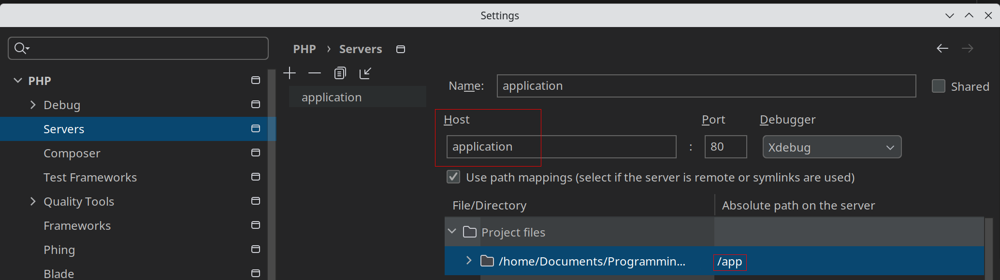

RoadRunner on Docker Skeleton
========

Basic dockerized skeleton for run PHP as a worker inside a [RoadRunner](https://github.com/roadrunner-server/roadrunner).

I drew inspiration from [roadrunner-docker-skeleton](https://github.com/n1215/roadrunner-docker-skeleton) to create 
this repository. Official repository [here](https://github.com/roadrunner-server/roadrunner).


### Requirements
- Bash
- Docker
- Docker Compose

### Install

```bash
git clone https://github.com/matiux/roadrunner-skeleton.git && cd roadrunner-skeleton
cp -n .env.example .env
make setup
make up
```
and access to http://localhost:8080

### Workers
#### [HttpWorker](./src/Worker/HttpWorker.php)

To create HTTP worker, you need to install the required composer packages:

```bash
composer require spiral/roadrunner-http nyholm/psr7
```

Check out docs [here](https://roadrunner.dev/docs/php-worker/current/en#worker-types)

### Some useful make command
```bash
make help
```
Print the command help list.

```bash
make rr-reset
```
Manual restarting. One of the way reloading server is using this console command.

```bash
make rr-workers
```
Shows workers list.

### Auto reloading
Auto reloading is enabled by default. RoadRunner detects PHP file changes and reload connected 
services. To turn off this feature, set false `pool.debug` in [.rr.yaml](./config/.rr.yaml). See: 
[Roadrunner Auto-Reloading](https://roadrunner.dev/docs/php-developer/current/en)

### PHP Workers — Debugging
This skeleton is configured to allow debugging with Xdebug. 
First of all, ensure that the `pool.debug` option is set to true or `pool.num_workers` option is set on 1.

Configure PhpStorm



*Note, you must use those specific names for the `host` (application) and `Absolute path on the server` (/app)*

Then:
```bash
make upd #or make up and continue in another shell
make enter # enter the RR container
xmode.debug # Set Xdebug in debug model
rr -c /etc/rr.yaml reset # Reload RR
```

At this point, set your breakpoint and run application http://localhost:8080
